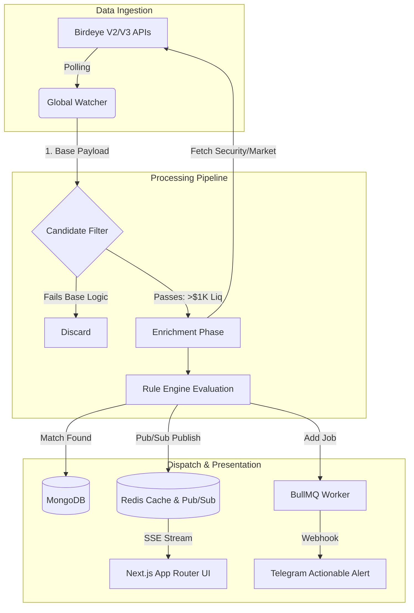

# 🦅 Birdeye Catalyst
**The Ultimate On-Chain Sentinel & Automated Strategy Engine**

[](https://birdeye.so)
[](https://nextjs.org)
[](https://typescriptlang.org)
[](https://redis.io)
[](#)

> **"Data is just noise until you find the Catalyst."**  
> Birdeye Catalyst is a highly-optimized, industrial-grade DeFi intelligence hub. It chains multiple advanced Birdeye endpoints to automate market vigilance, run complex algorithmic strategies, and deliver actionable alerts before the crowd catches up.

---

## 💎 The Market Opportunity & Product Vision

### The Problem: The Speed and Noise of Solana
The Solana ecosystem moves at a breakneck pace. With thousands of tokens launching daily via Pump.fun and Raydium, the market suffers from massive **Information Overload**. Retail traders are fighting algorithms and losing sleep trying to manually monitor charts, verify security contracts, and catch volume spikes. The current tools are passive—they require the user to look at them.

### The Solution: Automated, Personalized Vigilance
Birdeye Catalyst is not just another dashboard; it is an **execution-ready intelligence network**. It acts as a personal, automated hedge-fund engine for the retail trader. Users deploy "Sentinel Nodes" that constantly monitor the Birdeye data firehose, automatically evaluating tokens against custom logic gates, and dispatching actionable alerts directly to Telegram.

### Who is this for?
- **The Solana Degen**: Instantly sniping new listings the moment they migrate from Pump.fun, with built-in rug-pull checks.
- **The Swing Trader**: Tracking massive liquidity shifts ("Whale Radar") and trending momentum over 24-hour periods.
- **Alpha Communities**: Deploying pre-configured "Strategy Blueprints" to their private groups, ensuring the whole community trades with the same real-time edge.

By combining institutional-grade data (Birdeye) with automated logic, Catalyst transforms reactive traders into proactive snipers.

---

## 🏗️ Architecture & Engineering

Catalyst was engineered to solve complex state evaluation and high-frequency data ingestion while strictly adhering to API Compute Unit (CU) constraints. 

### 🧠 1. The Rule Engine (Strategy Pattern)
At the core of the worker service is the `RuleEngine`. Instead of hardcoded if/else blocks, we implemented a robust **Strategy Pattern**. Users define logic gates via the UI (e.g., `liquidity > 10000 AND security_score > 80 AND no_mint_authority == true`). 
The `OperatorRegistry` dynamically resolves these conditions against incoming data payloads, allowing for infinitely scalable and customizable trading strategies without altering the core codebase.

### ⚡ 2. Global Watcher & "Candidate Enrichment" Pipeline
Polling Birdeye endpoints (`token_security`, `market-data`) for every single rule for every single user is an O(N*M) nightmare that would obliterate API limits. We engineered a **Centralized Watcher Pattern** with a **Multi-Tier Filtering Pipeline**:

- **Tier 1 (Base Aggregation)**: The Global Watcher fetches generic lists (`new_listing`, `token_trending`) *once* per cycle, regardless of how many users have rules for them.
- **Tier 2 (Candidate Selection)**: We run a zero-cost local evaluation. Tokens must pass base algorithmic thresholds (e.g., Minimum $1,000 Liquidity, Volume spikes) locally before moving forward.
- **Tier 3 (Enrichment)**: Only the qualified "Candidates" from Tier 2 trigger the expensive `token_security` and `market-data` endpoints. 

**Result**: We successfully chained 4 distinct Birdeye endpoints while reducing API Compute Unit consumption by **over 90%**, ensuring extreme economic viability.

### 📡 3. Real-Time Distributed Systems (Redis, BullMQ, SSE)
- **High-Speed Cache & Pub/Sub**: MongoDB is for persistence; Redis is for speed. As the Rule Engine processes matches, it pushes payloads into Redis via `Publish` commands.
- **Server-Sent Events (SSE)**: The Next.js frontend connects to a persistent SSE stream. Redis pushes real-time alpha directly to the user's browser via the `/api/alerts/stream` endpoint, achieving zero-refresh, sub-second dashboard updates.
- **Asynchronous Dispatching**: Generating a match and sending a Telegram notification are decoupled. Matches are bulk-loaded into **BullMQ** (backed by Redis), providing exponential backoff, retry logic, and concurrent processing for thousands of potential user webhooks.

### 📐 System Flow Diagram



---

## ✨ Core Platform Features

1. **Strategy Market (Blueprints)**: Single-click deployment of proven DeFi logic. Users can clone "The Degenerate Pack" or "Whale Follower" directly into their personal node network.
2. **Actionable Telegram Deep-Links**: Alerts aren't just text. They include 1-click deep links to Jupiter (for instant swaps), Birdeye Charts, and RugCheck audits directly inside Telegram.
3. **Visual Risk Radar**: Stop reading JSONs. Instantly assess a token's safety profile through our custom UI radar map powered by the `token_security` endpoint (mapping scores, mint/freeze authorities, and top 10 holder concentration).
4. **Referral Ecosystem**: Built-in viral mechanics where users earn "Pro Tier" status by inviting others, managed securely through Telegram-linked database authentication.

---

## 🚀 The "Hyper-Speed" Vision (Roadmap)

To ensure operational sustainability on the standard Free Tier limits (30K Compute Units/mo), Catalyst is currently running an optimized **"Safe Mode"** (Pro users: 1-hour polling, Free users: 4-hour polling). Our Candidate Enrichment algorithm extracts maximum value from every Compute Unit.

### The Scaling Strategy
If Birdeye Catalyst scales and secures **Birdeye Data Premium Plus** access, the infrastructure is already engineered to immediately unlock the **"Hyper-Speed Engine"**:
- **Pro Tier Polling:** Reduced to **10 seconds**.
- **Free Tier Polling:** Reduced to **1 minute**.

This single variable change will instantly transform Catalyst from a powerful periodic scanner into the **absolute fastest, most granular retail sentinel network on Solana**. By leveraging premium API infrastructure, we will provide our users with an insurmountable speed edge—which is exactly what traders are willing to pay for.

---

## ⚙️ Quick Start & Installation

### Prerequisites
- Node.js 20+
- Docker & Docker Compose
- Birdeye API Key
- Telegram Bot Token

### Setup
1. **Clone the repository**:
   ```bash
   git clone https://github.com/erenen1/birdeye-catalyst.git
   cd birdeye-catalyst
   ```
2. **Environment Configuration**:
   ```bash
   cp apps/web/.env.example apps/web/.env
   cp apps/worker/.env.example apps/worker/.env
   # Add your BIRDEYE_API_KEY and TELEGRAM_BOT_TOKEN
   ```
3. **Deploy the Stack**:
   ```bash
   docker compose up --build -d
   ```
4. **Access**:
   - Web App: `http://localhost:3000`
   - Worker Logs: `docker logs -f worker`

---

## 🤝 Developed By
Engineered with precision by **Eren Celik** for the **Birdeye Data Build in Public Competition**.

*"Transforming the noise of DeFi into the signal of opportunity."*
