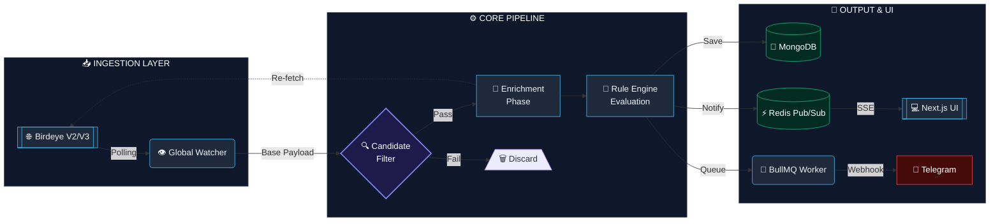

# Birdeye Catalyst
**The Ultimate On-Chain Sentinel & Automated Strategy Engine**

[](https://birdeye.so)
[](https://nextjs.org)
[](https://typescriptlang.org)
[](https://redis.io)
[](#)


> **"Data is just noise until you find the Catalyst."**  
> Birdeye Catalyst is a highly-optimized, industrial-grade DeFi intelligence hub. It chains multiple advanced Birdeye endpoints to automate market vigilance, run complex algorithmic strategies, and deliver actionable alerts before the crowd catches up.

---

## 💎 The Market Opportunity & Core Vision

### The Problem: The Speed and Noise of DeFi
The crypto ecosystem, particularly Solana, moves at a breakneck pace. With thousands of tokens launching daily via Pump.fun and Raydium, the market suffers from massive **Information Overload**. Retail traders are fighting algorithms and losing sleep trying to manually monitor charts, verify security contracts, and catch volume spikes. The current analytical tools are passive—they require the user to actively stare at them.

### The Solution: Automated, Personalized Vigilance
Birdeye Catalyst is not just another dashboard; it is an **execution-ready intelligence network**. It acts as a personal, automated hedge-fund engine for the retail trader. Users deploy "Sentinel Nodes" that constantly monitor the Birdeye data firehose, automatically evaluating tokens against custom logic gates, and dispatching actionable alerts directly to Telegram.

### Target Audience & Utility
- **The Speed Trader**: Instantly sniping new listings the moment they migrate from Pump.fun, with automated rug-pull checks.
- **The Swing Trader**: Tracking massive liquidity shifts ("Whale Radar") and trending momentum over 24-hour periods.
- **Alpha Communities**: Deploying pre-configured "Strategy Blueprints" to their private groups, ensuring the whole community trades with the same real-time edge.

---

## 🏗️ Architecture & Engineering

Catalyst was engineered to solve complex state evaluation and high-frequency data ingestion while strictly adhering to API Compute Unit (CU) constraints. 

### 1. The Rule Engine (Strategy Pattern)
At the core of the worker service is the `RuleEngine`. Instead of hardcoded evaluation blocks, we implemented a robust **Strategy Pattern**. Users define logic gates via the UI (e.g., `liquidity > 10000 AND security_score > 80 AND no_mint_authority == true`). The `OperatorRegistry` dynamically resolves these conditions against incoming Birdeye payloads, allowing for infinitely scalable and customizable trading strategies without altering the core codebase.

### 2. Global Watcher & "Candidate Enrichment" Pipeline
Polling Birdeye endpoints (`token_security`, `market-data`) for every single user rule individually is an O(N*M) nightmare that would obliterate API limits. We engineered a **Centralized Watcher Pattern** with a **Multi-Tier Filtering Pipeline**:

- **Tier 1 (Base Aggregation)**: The Global Watcher fetches generic lists (`new_listing`, `token_trending`) *once* per cycle, regardless of how many users have rules for them.
- **Tier 2 (Candidate Selection)**: We run a zero-cost local evaluation. Tokens must pass base algorithmic thresholds (e.g., Minimum $1,000 Liquidity) locally before moving forward.
- **Tier 3 (Enrichment)**: Only the qualified "Candidates" from Tier 2 trigger the expensive `token_security` and `market-data` endpoints. 

**Result**: We successfully chained 4 distinct Birdeye endpoints while reducing API Compute Unit consumption by **over 90%**.

### 3. Real-Time Distributed Systems (Redis, BullMQ, SSE)
- **High-Speed Cache**: Redis pushes real-time alpha directly to the user's browser via a Server-Sent Events (SSE) stream, achieving zero-refresh dashboard updates.
- **Asynchronous Dispatching**: Generating a match and sending a Telegram notification are decoupled. Matches are bulk-loaded into **BullMQ** (backed by Redis), providing concurrent processing for thousands of potential user webhooks.



---

## 🧠 The Catalyst AI Engine

At the heart of our macro-analysis engine lies a state-of-the-art Python (FastAPI/PyTorch) microservice designed for institutional-level on-chain analysis. 

### 1. Time-Series Transformer Architecture
We discarded standard LSTMs in favor of a custom **Time-Series Transformer**. Utilizing Positional Encodings and Multi-Head Attention, the model evaluates 4H batch sequences (up to 60 periods) to understand long-term price and volume relationships, predicting token momentum (BULLISH, BEARISH, NEUTRAL, HIGH_RISK) with deep contextual awareness.

### 2. Multi-Dimensional Feature Engineering
The AI does not look at raw price alone. Before inference, the engine calculates:
- **Directional Buy/Sell Pressure:** Evaluating Maker/Taker ratios to distinguish genuine accumulation from panic selling.
- **Smart Money Index:** Normalizes average trade size against the total liquidity pool to flag extreme Insider/Sniper activity.
- **Advanced Technical Indicators:** Real-time computation of RSI, MACD, and Volume-Weighted Average Price (VWAP) as direct inputs to the Transformer.

### 3. Asymmetric Risk Engine (The Guillotine)
The system employs a ruthless, rules-based multiplier on top of the AI base score:
- **Extreme Risk (0.1x Penalty):** If the Top 10 holders own >80% of the supply and the Liquidity Pool is *not* burned.
- **Ultra Safe (2.0x Bonus):** If the LP is burned, ownership is decentralized (<20%), and Freeze/Mint authorities are revoked.
- **Market Baseline (Beta):** The engine cross-references token performance against macro Solana (SOL) price changes, rewarding tokens that show resistance to market-wide dumps.

### 4. Production-Ready Infrastructure
- **Stateless Redis Caching:** Responses are cached via Redis to ensure sub-millisecond response times during high-traffic loads.
- **Batch Inference & Masking:** The endpoint accepts `BatchAnalyzeRequest` payloads, applying attention masks (padding) to process hundreds of token trajectories simultaneously via matrix multiplication.
- **Focal Loss Training:** The model is built using Focal Loss to combat the severe class imbalance in DeFi (where 95% of tokens fail), forcing the AI to focus on discovering the rare, high-alpha candidates.

---

## ✨ Core Platform Features

1. **Strategy Market (Blueprints)**: Single-click deployment of proven DeFi logic. Users can clone "The Degenerate Pack" or "Whale Follower" directly into their personal node network.
2. **Actionable Telegram Deep-Links**: Alerts aren't just text. They include 1-click deep links to Jupiter (for instant swaps), Birdeye Charts, and RugCheck audits directly inside Telegram.
3. **Visual Risk Radar**: Stop reading JSONs. Instantly assess a token's safety profile through our custom UI radar map powered by the `token_security` endpoint (mapping scores, mint/freeze authorities, and top 10 holder concentration).
4. **Referral Ecosystem**: Built-in viral mechanics where users earn "Pro Tier" status by inviting others, managed securely through Telegram-linked database authentication.

---

## 🌐 Macro-Analysis vs. Real-Time Execution

### The Compute Unit (CU) Reality & Our Current "Macro" Engine
Monitoring high-velocity chains like Solana in real-time is an expensive endeavor. With our current Free Tier API limit of **30,000 Compute Units/month**, continuous second-by-second polling is impossible. 

Instead of building a broken sniper bot, we engineered Catalyst V1 as a **Macro-Analysis Engine**. We operate on a deliberate 4-hour batch-processing cycle. 
- **Batch Ingestion:** Every 4 hours, Catalyst ingests a massive payload of ecosystem data.
- **AI/ML Scoring:** This data is processed asynchronously and evaluated for high-timeframe momentum, liquidity health, and "Smart Money" accumulation. 
- **The Result:** We provide users with deep, actionable intelligence on market shifts, rather than noisy, second-by-second micro-fluctuations.

### 🚀 The "Hyper-Speed" V2 Roadmap (If We Win)
Building on the momentum and robust architectural foundation that secured Catalyst a Top 10 finish in Sprint 2, our vision for the hackathon prize is absolute real-time dominance.

If Birdeye Catalyst secures **1st Place** and the accompanying **Birdeye Data Premium Plus Plan** (60M+ CUs and Enterprise WSS access), we will immediately trigger our V2 deployment:

1. **Enterprise WebSocket (WSS) Integration:** We will bypass REST API polling entirely for our core modules. The Catalyst Node.js engine is already built on an event-driven architecture, ready to consume Birdeye's live WSS firehose for zero-latency data ingestion.
2. **The $29/mo Catalyst Pro Tier:** The ultimate monetization strategy. The real-time WSS sniper capabilities, instant RugCheck triggers, and millisecond execution alerts will be strictly gated behind our **Pro Tier**. Users can seamlessly upgrade via our integrated **Sphere** payment gateways.
3. **Free Tier Lead Magnet:** The Free Tier will remain on the highly valuable 4-hour Macro-Analysis engine, acting as the perfect lead magnet to onboard communities before upselling them to Pro.
4. **Full Security Audits:** We will instantly enable live data for honeypot, rug pull, and mint/freeze authority checks via the `/defi/token_security` endpoint (currently mocked due to Free Tier 401 errors).

### 💼 The Break-Even Point
The 1st Place prize provides a 60-day runway of the Premium Plus API. By unlocking the WSS-powered "Pro Tier" at $29/month, **we only need 17 paying customers** to self-fund the Birdeye Enterprise API permanently. Catalyst is not just a hackathon build; it is a scalable, highly viable SaaS ready for market.

---

## ⚙️ Quick Start & Installation

### Prerequisites
- Node.js 20+
- Docker & Docker Compose
- Birdeye API Key
- Telegram Bot Token

### Setup
1. **Clone the repository**:
   ```bash
   git clone https://github.com/erenen1/birdeye-catalyst.git
   cd birdeye-catalyst
   ```
2. **Environment Configuration**:
   ```bash
   cp apps/web/.env.example apps/web/.env
   cp apps/worker/.env.example apps/worker/.env
   # Add your BIRDEYE_API_KEY and TELEGRAM_BOT_TOKEN
   ```
3. **Deploy the Stack**:
   ```bash
   docker compose up --build -d
   ```
4. **Access**:
   - Web App: `http://localhost:3000`
   - Worker Logs: `docker logs -f worker`

---

## 🤝 Developed By
Engineered with precision by **Eren Celik** for the **Birdeye Data Build in Public Competition**.

*"Transforming the noise of DeFi into the signal of opportunity."*
